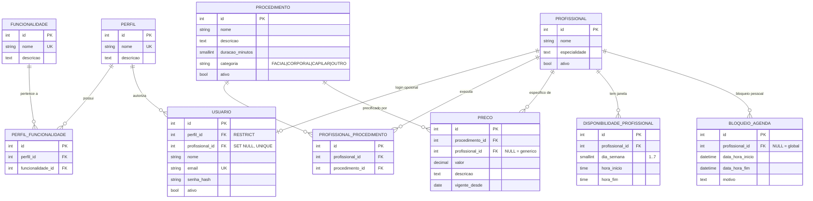
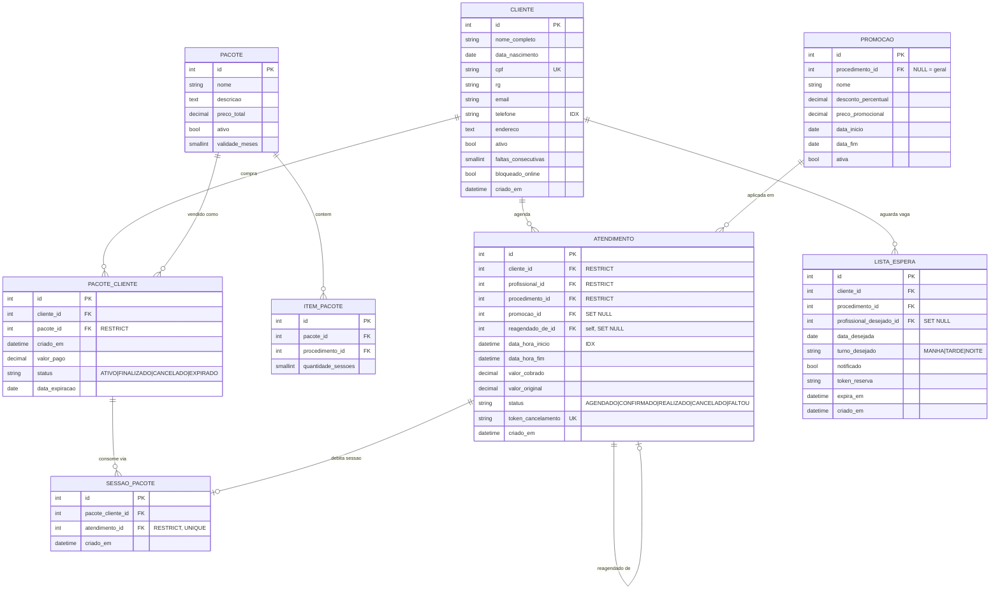
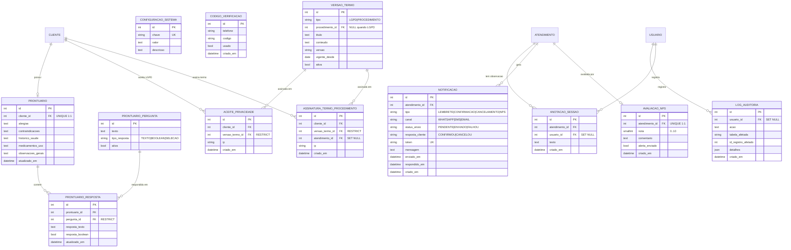

# ShivaZen — MER (Modelo Entidade-Relacionamento)

> Fonte da verdade: `app_shivazen/models.py` (Django) + `signals.py`.
> Documentacao narrativa complementar: `docs/mer_base_documentacao.txt`.
> Renderiza nativo no GitHub/GitLab/VS Code com suporte a Mermaid.

O modelo foi dividido em 3 paginas para caber em A4 landscape sem
perder legibilidade. A divisao segue os dominios funcionais do sistema:

1. **Pagina 1 — Acesso, Profissionais e Catalogo**
2. **Pagina 2 — Clientes, Agendamentos, Pacotes, Fila e Promocoes**
3. **Pagina 3 — Prontuario, Termos, Notificacoes, NPS e Infra**

---

## Pagina 1 — Acesso, Profissionais e Catalogo

Cobre controle de acesso (RBAC), profissionais e o catalogo de
procedimentos, precos e disponibilidade.



**Notas de leitura:**

- `USUARIO.profissional_id` eh OneToOne com SET NULL: um profissional
  pode ter (ou nao) uma conta de login, e apagar o profissional nao
  apaga a conta.
- `PRECO.profissional_id` NULL indica preco generico do procedimento
  (fallback); quando preenchido, eh preco especifico daquele
  profissional e tem precedencia na consulta.
- `BLOQUEIO_AGENDA.profissional_id` NULL representa bloqueio global
  da clinica (feriado, manutencao).
- `DISPONIBILIDADE_PROFISSIONAL` deliberadamente NAO tem UNIQUE
  composto, pois precisa suportar multiplos turnos no mesmo dia.

---

## Pagina 2 — Clientes, Agendamentos, Pacotes, Fila e Promocoes

Cobre o nucleo operacional do sistema: o ciclo de vida do atendimento
e seus satelites (cliente, promocoes, pacotes e fila de espera).



**Notas de leitura:**

- As tres FKs principais do ATENDIMENTO (cliente, profissional e
  procedimento) usam RESTRICT: dados historicos sao imutaveis e
  nao podem ser apagados indiretamente por remocao de catalogo.
- SESSAO_PACOTE tem relacao 1:1 com ATENDIMENTO e eh criada
  automaticamente pelo signal quando `status=REALIZADO` e o
  cliente tem pacote ativo cobrindo o procedimento.
- PACOTE_CLIENTE.status transita para FINALIZADO automaticamente
  via `verificar_finalizacao()` quando todas as sessoes do pacote
  foram consumidas, e para EXPIRADO quando a data_expiracao eh
  ultrapassada durante uma tentativa de debito.
- LISTA_ESPERA eh consultada pelo signal post_save de ATENDIMENTO
  quando o status muda para CANCELADO/FALTOU, disparando
  notificacao assincrona via Celery.
- `PROFISSIONAL` aparece implicitamente neste diagrama como FK
  em ATENDIMENTO e LISTA_ESPERA — esta detalhado na Pagina 1.

---

## Pagina 3 — Prontuario, Termos, Notificacoes, NPS e Infra

Cobre prontuario medico (hibrido), termos de consentimento (LGPD +
por procedimento), log de notificacoes, avaliacao NPS e infraestrutura
de auditoria/configuracao.



**Notas de leitura:**

- O prontuario eh hibrido: `PRONTUARIO` guarda anamnese base
  permanente (1:1 com cliente), `PRONTUARIO_RESPOSTA` armazena
  respostas estruturadas por pergunta, e `ANOTACAO_SESSAO` guarda
  observacoes evolutivas ligadas a cada atendimento individual.
- `VERSAO_TERMO` eh uma tabela unica para dois tipos: LGPD (sem
  FK para procedimento) e PROCEDIMENTO (com FK). As tabelas de
  aceite sao distintas porque as regras de quando se re-assina
  diferem entre os dois tipos.
- `ASSINATURA_TERMO_PROCEDIMENTO` referencia o atendimento que
  originou a assinatura, mas a FK usa SET NULL: se o atendimento
  for removido, o registro legal da assinatura sobrevive.
- `NOTIFICACAO`, `AVALIACAO_NPS` e `ANOTACAO_SESSAO` sao
  dependentes de ATENDIMENTO (detalhado na Pagina 2) — as setas
  estao implicitas neste diagrama para manter o foco no dominio
  clinico/legal.
- `LOG_AUDITORIA.usuario_id` eh SET NULL para preservar a trilha
  de auditoria mesmo apos remocao do autor.

---

## Como exportar para PDF

### Opcao 1 — VS Code (mais simples no Windows)

1. Instale a extensao **Markdown PDF** (yzane.markdown-pdf).
2. Instale a extensao **Markdown Preview Mermaid Support**
   (bierner.markdown-mermaid).
3. Abra este arquivo (`docs/erd.md`), clique com o botao direito
   no editor e escolha `Markdown PDF: Export (pdf)`.
4. O PDF sai em `docs/erd.pdf`.

### Opcao 2 — Pandoc + mermaid-filter (linha de comando)

```bash
npm install -g mermaid-filter
pandoc docs/erd.md \
  --filter mermaid-filter \
  -o docs/erd.pdf \
  --pdf-engine=xelatex \
  -V geometry:landscape \
  -V geometry:margin=1.5cm
```

### Opcao 3 — mermaid-cli + HTML intermediario

O script `docs/erd.html` (gerado junto com este arquivo) ja
renderiza os tres diagramas com a biblioteca mermaid.js via CDN
e pode ser exportado para PDF direto pelo navegador
(`Ctrl+P` -> `Salvar como PDF` em modo paisagem).
